# MEXC Live Stats

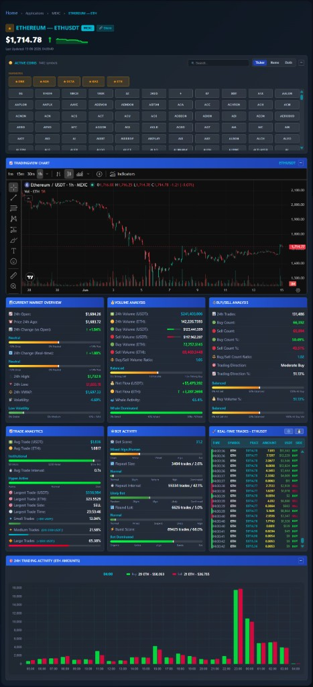

**Live MEXC spot statistics** on Logic Encoder — the interactive product lives at **[logicencoder.com/mexc-app/](https://logicencoder.com/mexc-app/)**, not on static article pages. Open the app, pick any USDT pair from the chip grid (or land with **`?coin=SYMBOL`** such as [ETHUSDT](https://logicencoder.com/mexc-app/?coin=ETHUSDT)), and get realtime trade tape, bot-activity scoring, TradingView chart, 24h analytics panels, hourly volume chart, favorites, export, and freeze — all in one WordPress-embedded shell. Shortcode **`[mexc_dashboard]`** drops the same UI on any page; **`symbol="PIUSDT"`** sets the default pair.

## Tech stack

| Layer | Technologies |
|-------|--------------|
| WordPress plugin | PHP, shortcodes, wp-admin dashboards, WordPress AJAX, WordPress REST ingest |
| Public UI | HTML, CSS, vanilla JavaScript, Chart.js, TradingView embed, MessagePack WebSocket client |
| Live backend | Python 3, FastAPI, MEXC protobuf WebSocket ingest, PostgreSQL |
| SEO SSR | Node.js Express — crawler HTML + Schema.org JSON-LD (separate from the live app) |
| Snapshots | Static HTML/JSON + chart PNGs pushed from backend |
| Search | XML sitemap for SEO URLs, IndexNow queue, auto-push on publish |
| Data | PostgreSQL trade history on backend; WordPress options for coin lists and SEO state |
| Hosting | WordPress on shared hosting; Python/Node services on self-hosted Linux servers |

## Live trading app (`/mexc-app/`)

The dashboard at [logicencoder.com/mexc-app/](https://logicencoder.com/mexc-app/) is a **single-page trading console**. Every control below is implemented in the plugin JavaScript (`mexcDashboard`); data comes from the self-hosted backend over WebSocket and REST.

### Realtime connection

- **WebSocket** — MessagePack frames carry `mexc_trade` ticks and periodic `mexc_stats` aggregates. Trades for the **active symbol** update the hero price, direction arrow, sparkline, tape rows, and the current hour on the 24h bar chart in the same event loop — no polling for headline price.
- **REST fallback** — `GET /api/stats/memory/{symbol}` loads full 24h stats when you switch pairs or when bootstrap has no cache yet. Hero **last price** seeds from `current_price`, then `24h_open`, VWAP, or high/low fallbacks; if still empty, `GET /api/trades?hours=24&limit=1` pulls the latest DB print. On symbol switch the hero clears to **—** immediately so the previous pair’s price never lingers.
- **Subscription** — switching chips sends a new `subscribe` action for the active pair; stats for other symbols are ignored so panels never show cross-contaminated data.

### Symbol header and navigation

- **Breadcrumb** — Home › MEXC › current pair name (updates on symbol switch).
- **Title row** — favorite star, **full name — TICKER**, MEXC badge, **Share** button.
- **Share** — copies the current page URL with `?coin=SYMBOL` to clipboard; button flashes confirmation feedback.
- **Hero price** — large USDT last trade formatted with **exchange price precision** and thousand separators from **1,000** upward; **direction arrow** (↑ buy tint, ↓ sell tint) follows the latest print side.
- **15-minute sparkline** — Chart.js line beside the price, fed from per-symbol price history in memory; **hover tooltip** on the mini chart shows the sampled price at that point.
- **Last updated** — clock time of the last applied tick.

### Favorites

- **Header star** — toggle favorite for the active pair.
- **Per-chip star** on each coin button in the grid — same list.
- **Favorites row** — dedicated chip strip above the full grid when you have favorites; hidden when empty.
- **localStorage** — `mexc_favorites` persists across sessions in the browser; wp-admin exposes **max favorites** (default cap stored in `mexc_max_favorites`).

### Active Coins picker

- **Symbol count** in the panel title — fleet size from backend bootstrap.
- **Search** — filters chips by ticker or full name; **×** clears input.
- **Display mode** — **Ticker**, **Name**, or **Both** on chips; saved in `mexc_coin_display_mode` localStorage.
- **Collapse (−/+)** — hides chip grid, search, and display toggle; state in `mexc_panel_collapse`.
- **Chip grid** — alphabetical USDT pairs; active chip highlighted; one click rebinds all panels and updates the URL bar without reload.

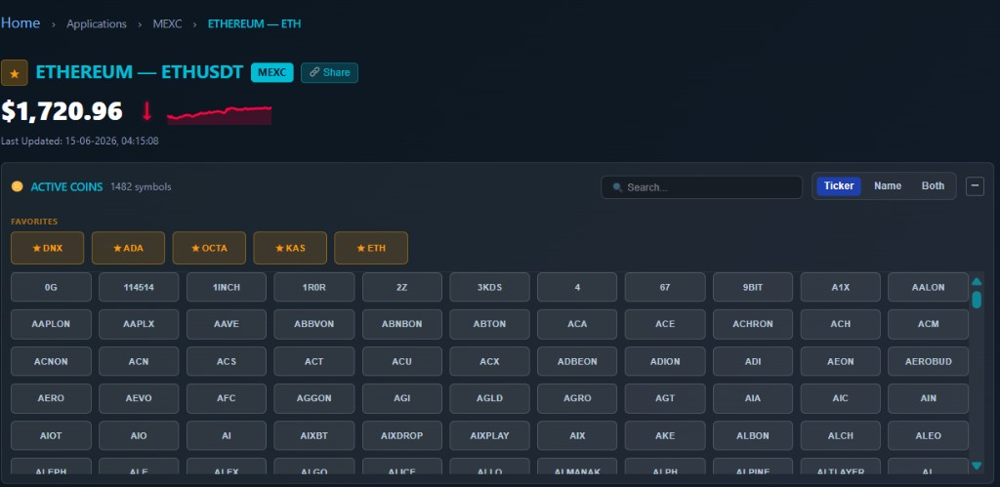

### TradingView chart

Embedded **TradingView** widget (`MEXC:SYMBOL`): timeframe toolbar, indicators, drawings, candlesticks, volume sub-chart. Panel header shows the active symbol. **Collapse** shrinks iframe height to zero and remembers preference. Iframe `src` reloads on every symbol switch.

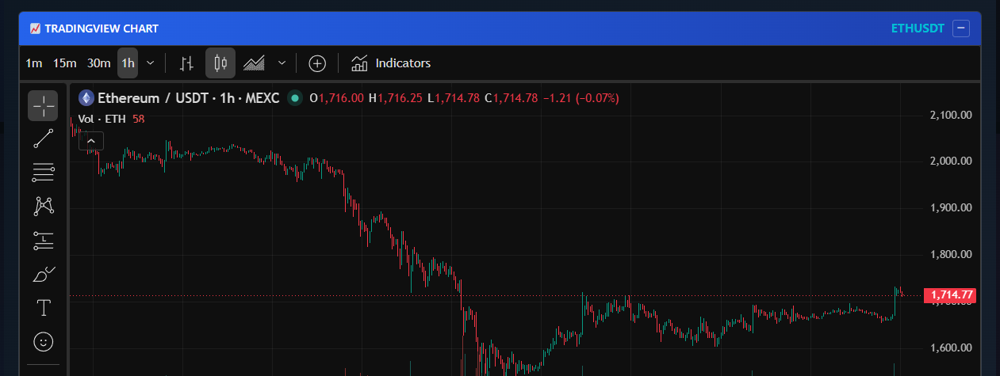

### 24h analytics panels

Three side-by-side panels summarize **rolling 24h structure** for the active pair (stats broadcast + REST):

**Current Market Overview** — 24h open, price 24h ago, change vs open and real-time change (each with a **−10% / 0% / +10%** sentiment bar and context label), 24h high and low, **VWAP**, **volatility** on a stable → wild scale.

**Volume Analysis** — total 24h volume in USDT and base asset; **buy vs sell volume** bars; **buy/sell volume ratio** on strong-sell → strong-buy scale; **net flow** in USDT and coins with direction arrow; **whale activity** on retail → whale dominance scale.

**Buy/Sell Analysis** — 24h trade count, buy/sell counts and percentages, **count ratio**, **trading direction** label and bar (all-sell → balanced → all-buy), **buy volume %** gauge.

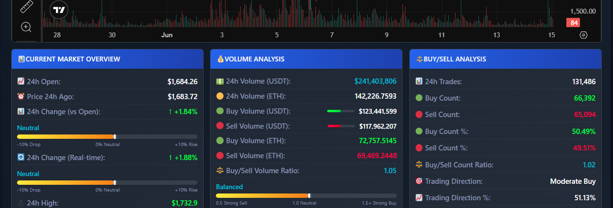

### Trade analytics, bot activity, and live tape

**Trade Analytics** — average trade size in USDT and base asset (micro → retail → pro scale); **average interval** between prints (active → slow); **largest trade** size, side, and time; distribution bars for **small**, **medium**, and **large** USDT tiers.

**Bot Activity** — **bot score** on clean → bot scale; **repeat size**, **repeat interval**, **round lot**, and **burst score** each with organic → suspect → likely → confirmed style bars and text labels.

**Real-Time Trades** — live scrolling ledger: time, symbol, price, amount, USDT notional, color-coded **BUY/SELL** with side stripe.

| Control | Behavior |
|---------|----------|
| **Realtime feed** | New rows append at the bottom; if you are at the bottom, the tape **follows the tail**; scroll up to read without auto-jump. |
| **Freeze ❄️** | Pauses live inserts; trades buffer in memory; button shows pending count; unfreeze flushes in order. |
| **Export ↓** | **TXT**, **CSV**, or **JSON** — merges PostgreSQL history (rolling window) with in-memory WebSocket rows, deduplicated; download filename includes symbol and timestamp. |

Only trades matching the **active symbol** update the tape and hero; other symbols still contribute to sparkline history caches.

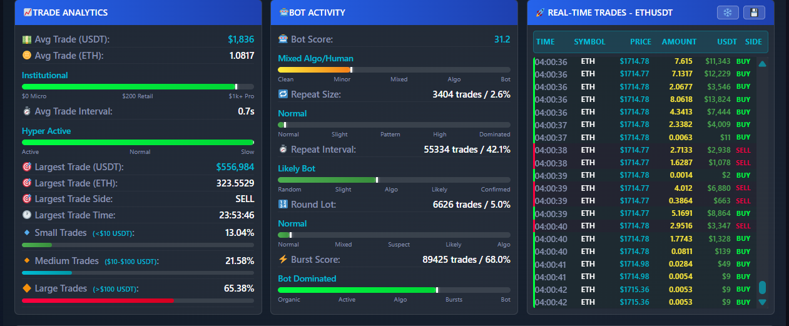

### 24h Trading Activity chart

Full-width **hourly bar chart** — green **buy** and red **sell** base-asset volume per clock hour for the active pair.

- **Fixed tooltip strip** above the chart — hour label, buy volume, sell volume (coin + USDT) with color swatches; defaults to the latest hour after load.
- **Hover / scrub** — moving across bars updates the fixed tooltip (Chart.js built-in tooltip disabled for stable mobile layout).
- **Live hour bar** — current hour grows as new trades arrive via `updateCurrentHourBar`.
- **Collapse** — same localStorage persistence as coins grid and TradingView.

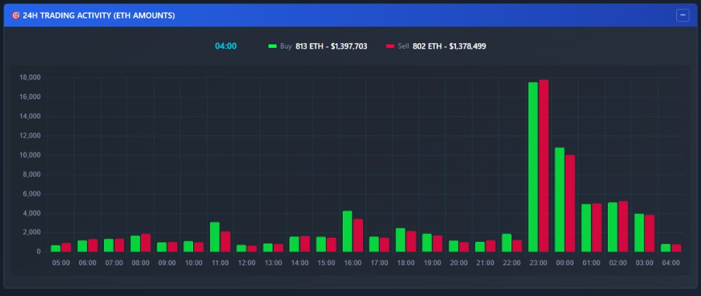

### Symbol switch workflow

Clicking a chip (or loading `?coin=`): clears hero to **—**, clears tape and stats cache, resets sparkline datasets, reloads TradingView, fetches REST stats for immediate panel + hero price fill, seeds from recent DB trade if needed, re-subscribes WebSocket, and backfills the tape from DB + WS. URL updates via `history.replaceState` so Share stays accurate.

## Monitor Dashboard

wp-admin **Monitor Dashboard** is the operator nerve center when something looks stale on the public site or trade counts drop after a deploy. Three panels mirror what you would otherwise SSH in to check.

### WebSocket throughput and health

Top status bar shows **API** and **SSR** reachability with response times, plus a green **Connected** badge when the admin monitor socket is live.

The **WebSocket throughput** grid tracks:

- **Messages/sec** and **download KB/s** — is data actually flowing right now?
- **Peak rate** and **total downloaded** — cumulative volume since server start.
- **Reconnects** and **server uptime** — spot flapping connections or recent restarts.
- **Min / avg / current latency** — end-to-end delay from exchange ingest to your browser.
- **Compression ratio** — MessagePack savings vs raw payload size.

The **3-hour rolling chart** plots download speed and messages/sec per minute — correlate a traffic drop with a deploy, a MEXC outage, or a subscription gap. If messages/sec flatlines while MEXC is healthy, scroll to System logs for auth or subscribe failures.

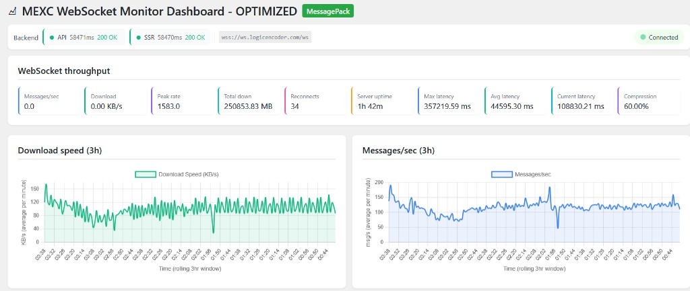

### Subscribed pairs and server metrics

The **subscribed pairs** chip wall lists every USDT market on the MEXC stream — a dense wall of symbol tags in alphanumeric order. Scroll it when you suspect a new listing never subscribed.

Four summary cards below:

| Card | What to watch |
|------|----------------|
| **Subscribed pairs** | Tracked vs actively printing counts. Footer: aggregate **trades/min** + **MEXC connection healthy**. |
| **Broadcast queue** | Internal fan-out depth — should stay near zero; growth means clients or Postgres writes lag. |
| **PostgreSQL** | Total trades stored, messages sent to browsers, server start time. |
| **Connected clients** | Unique IPs and WebSocket sessions reading right now. |

When public users report “frozen tape” but trades/min is nonzero, check **connected clients** — you may have a front-end issue, not ingest.

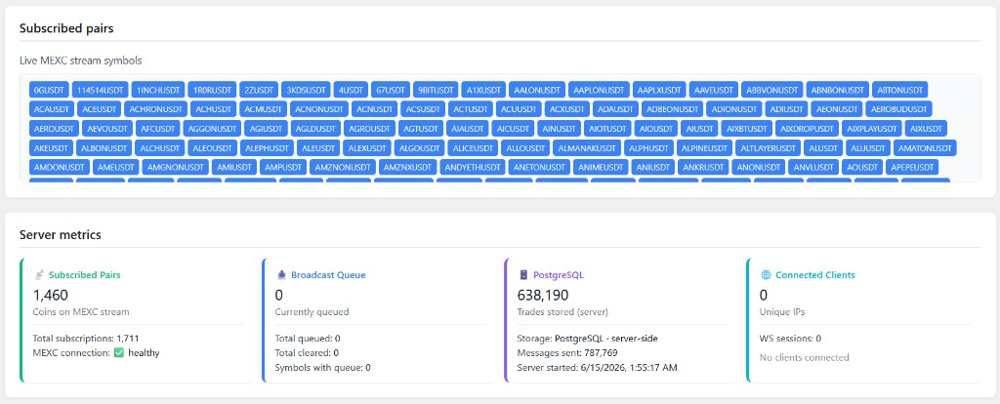

### System logs

Dark **system log** console filtered to connection lifecycle — no per-trade spam. Typical boot sequence:

1. Config loaded from server.
2. Admin monitor initializes (MessagePack mode).
3. WebSocket connect attempt with URL and retry count.
4. Authentication success with masked API key prefix.
5. Bulk subscribe to **all** symbols (full fleet list; UI truncates display).
6. Server welcome and **successfully subscribed** confirmation.

Use when the public site shows zero trades/min but MEXC itself is up — you will see whether auth failed, subscribe timed out, or the socket never reconnect after a key rotation.

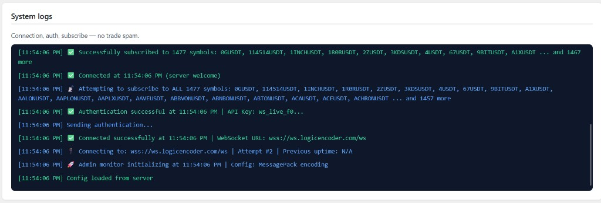

## Coin Manager

wp-admin **Coin Manager** is fleet hygiene across every tracked USDT pair — add new listings, prune delisted symbols, reload from the server bootstrap, and validate SEO output without leaving WordPress.

### Overview and dead coins

Four stat cards summarize fleet health:

| Card | Meaning |
|------|---------|
| **Tracked coins** | Symbols on the server list; footer shows aggregate trades/min. |
| **Live stream** | Pairs receiving trades now; footer counts idle (no print in 60s). |
| **Never traded** | Added but no historical print yet — common right after listing. |
| **Dead / missing** | Delisted on MEXC, removed from stream, or never subscribed. |

The **Dead & missing** panel lists red chips for symbols no longer on the exchange. One click **removes** them so sitemap and SSR do not 404 forever. **Refresh dead list** pulls the latest diff from the backend after a MEXC maintenance window.

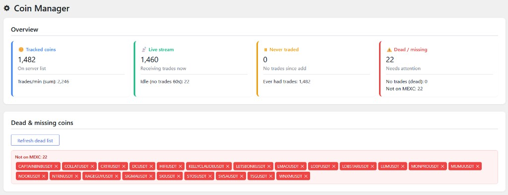

### Add, reload, and tracked list

**Reload symbols on server** syncs the WordPress coin list with the Python bootstrap — run after a backend deploy or MEXC listing batch.

- **Single add** — type a symbol, press Add coin.
- **Bulk import** — paste one symbol per line, **Add all** for dozens of new listings.

The **All tracked coins** table is the sortable fleet roster: symbol, **trades/min**, **stream** status (live vs idle), **ever traded** flag, and **Remove** per row. **Refresh now** updates stream stats without reloading the page.

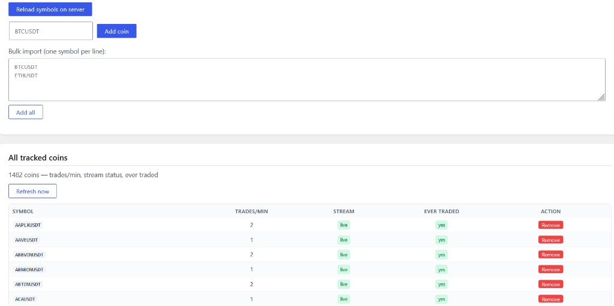

### Schema.org validation

Before you push a new coin to production SEO, pick a symbol and hit **Run validation**. Two layers:

**Python API — server stats**: connected clients, messages sent, latency (min / max / avg), compression ratio, subscription room counts.

**Node SSR — HTML structure checks**: Bot Activity section, 24h hourly table, KPI strip, ring gauge, Schema.org JSON-LD block, symbol string in document, HTML byte size sanity check.

The expandable **JSON-LD key inventory** lists every Schema.org field the SSR emitted. Operators confirm Google Rich Results will see a real `Dataset`, not a stub page.

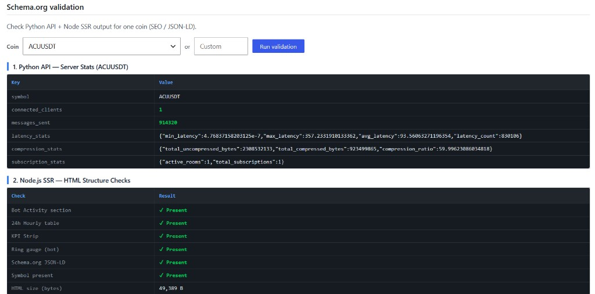

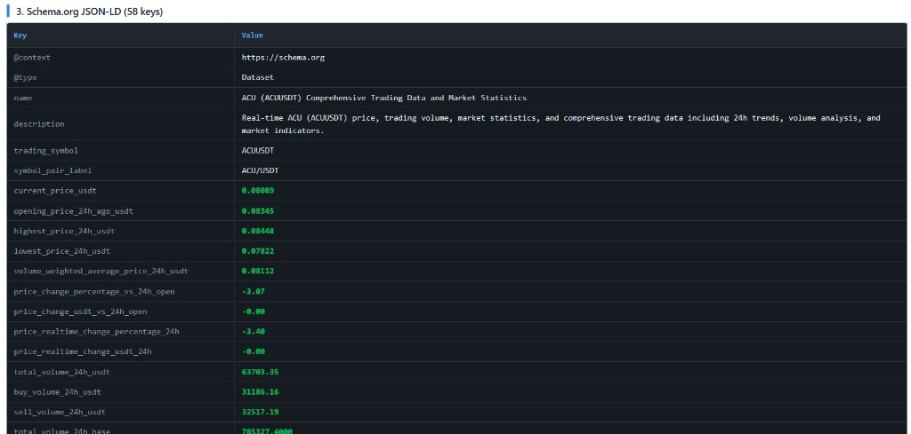

### Activity log

Timestamped **activity log** records operator actions: coin add/remove, bulk import results, server reload (with POST status), auto-refresh coin-count changes, and success/warning/error color coding.

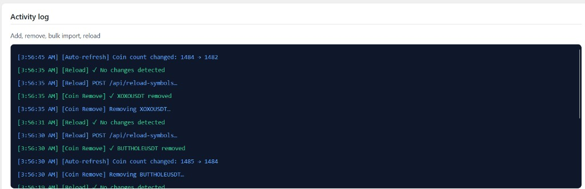

## Sitemap and IndexNow

Search discovery is first-class — a per-coin URL for every tracked symbol would be impossible to submit by hand.

### Sitemap status and IndexNow queue

**MEXC Sitemap & Indexing** dashboard shows:

- **Public sitemap URL** with live HTTP check.
- **WordPress hook** registered and **static file** present for fallback.
- **Total URLs** in sitemap and cache timestamp.
- Buttons to **view XML**, open **Google Search Console**, and **save static sitemap file** after bulk coin changes.

**IndexNow queue** panel tracks pending URLs, last batch time/status, sent vs remaining counts, and **last push new coins** after a listing batch.

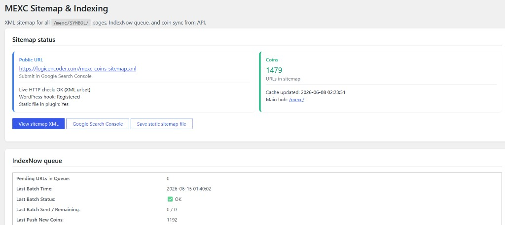

### Auto-push, coin table, and API sync

- **Auto push on publish** — when a WordPress post or page goes live, its permalink hits IndexNow automatically.
- **Coins in sitemap** — paginated table of symbol + path — catch typos before Google does.
- **Sync now** — pulls the authoritative coin list from the Python API bootstrap and rebuilds sitemap entries.

Typical workflow after MEXC lists new pairs: bulk add in Coin Manager → **Reload symbols on server** → **Sync now** on sitemap → watch IndexNow queue drain → spot-check one symbol in Schema validation.

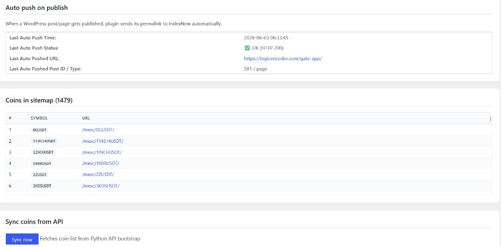

## Search discovery (crawlers only)

Humans use **`/mexc-app/`**. Separate **SEO URLs** under `/mexc/{SYMBOL}/` serve crawler HTML + Schema.org JSON-LD from Node SSR — useful for search, not the interactive product. Static snapshots under `/snapshots/mexc/` backfill when SSR is unavailable.

## Shared hosting headroom (corroboration)

Logic Encoder publishes the MEXC dashboard on **WordPress shared hosting** — the right layer for shortcodes, sitemaps, IndexNow, and cached snapshot HTML, but the wrong place to absorb a full-exchange trade firehose. From the start the goal was to **keep WordPress thin**: PHP renders the shell, stores coin lists and SEO state, and receives finished payloads. Ingest, aggregation, PostgreSQL, MessagePack fan-out, chart generation, and SSR data bundles run on **self-hosted Linux servers** with async workers — not inside shared-hosting PHP.

That split was a deliberate optimization on tight shared-hosting limits. **More than 1,400 USDT spot pairs** run on the live MEXC install; the same architecture carries **roughly 700 Gate.io pairs** on the sibling Gate stats product. Visitors still get realtime tapes and rolling analytics in the browser; WordPress mostly **displays and indexes** what the backend already computed. Updates keep flowing over WebSocket with REST and transient mirrors as fallback.

After offloading ingest and fan-out, shared-hosting resource graphs show large margins while both fleets run — **corroboration below**, not the product story. CPU, memory, PHP workers, disk throughput, IOPS, and concurrent process charts sit well below plan ceilings.

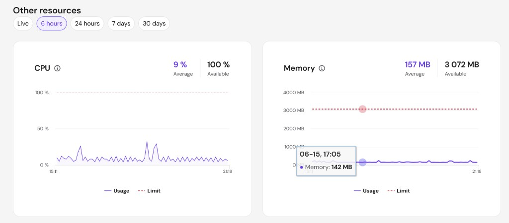

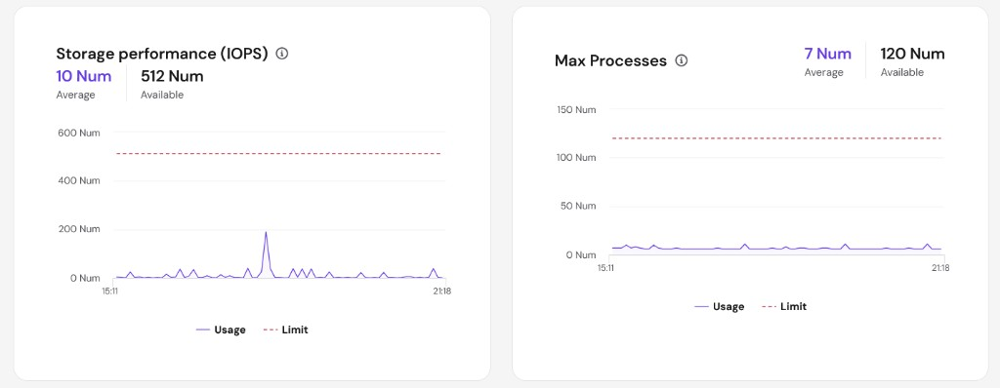

Private code: [mexc-live-stats-plugin](https://github.com/logicencoder/mexc-live-stats-plugin) · live data [mexc-live-stats-backend](https://github.com/logicencoder/mexc-live-stats-backend)

Backend overview: [mexc-live-stats-backend-overview](https://github.com/logicencoder/mexc-live-stats-backend-overview)

See [REPOS.md](REPOS.md).

---

**Made by [Logic Encoder](https://logicencoder.com)** · [GitHub](https://github.com/logicencoder) · [Contact](https://logicencoder.com/contact/)
